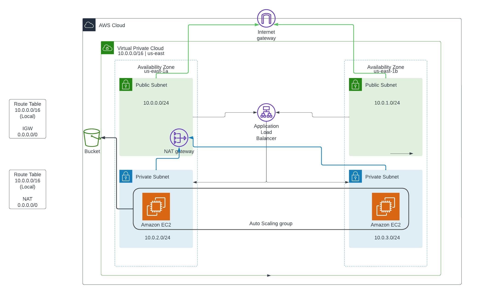

# Project Outline

For this project, I've are deploying a highly available company intranet web portal across multiple availability zones and EC2 instances behind a load balancer. The EC2 instances were placed within an autoscaling group that monitored the EC2 CPU usage as the metric to determine when to scale. They will additionally be monitored by CloudWatch and have a dashboard to display metrics.

The EC2 instances will be bootstrapped and use a custom script to automatically download the websites file(s) from S3 (given read-only access). This script automatically updates, installs httpd, does any required config, and displays the web page while also displaying the EC2 instances instanceID and Availability Zone, which will be retrieved from the metadata endpoint. 

## Pre-requisites
- An AWS account
- AWS CLI 
- Terraform

## Terraform Commands
Sign into AWS via the CLI
```text
aws configure
```
- or for SSO
```text
aws sso --profile <profileName>
```

Initialize Terraform
```text
terraform init
```

Run Terraform plan
```text
terraform plan
```

Apply Teraform Changes
```text
terraform apply
```


